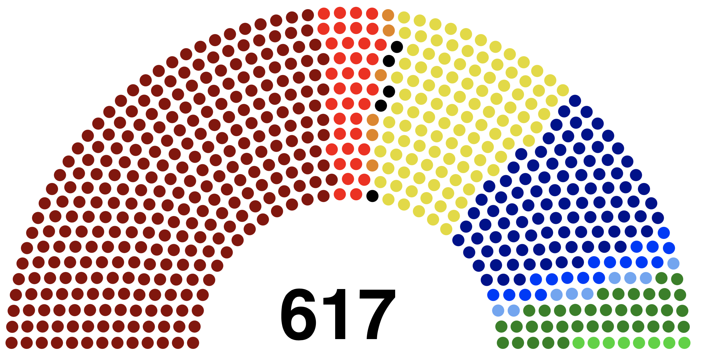
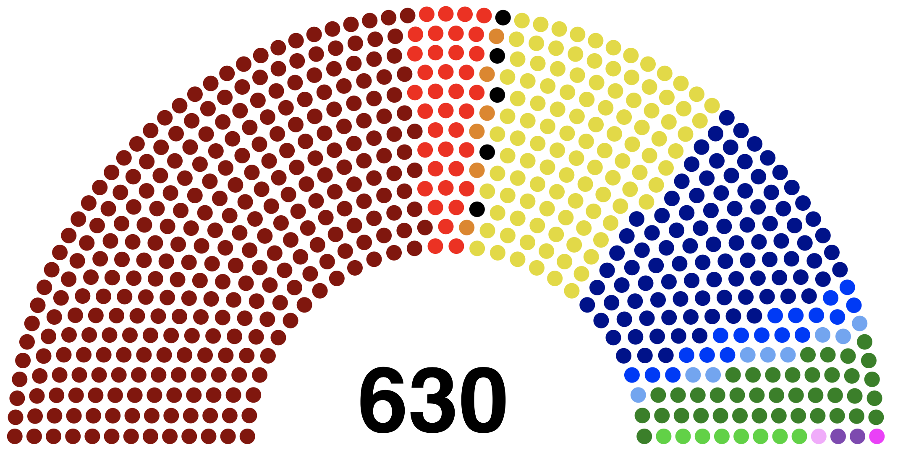

Progetto di Ingegneria Informatica : **Simulatore di Sistemi Elettorali**

Amabili Laura

dire di installare plotly per l'output


# Introduzione

## Obiettivo

L'obiettivo del progetto è quello di realizzare un simulatore di sistemi elettorale. La parte di questo progetto che ho voluto realizzare è stata quella di ampliare il campo di leggi elettorali simulate.
Il progetto era già stato iniziato da un altro studente e lo scopo era quello di aggiungere successivamente altre leggi elettorali necessarie. 

La repository che mi è stata consegnata prevedeva una struttura di base che aveva l'obiettivo di aiutare la realizzione delle leggi, infatti essa attraverso regole e sintassi prestabilite costringe a seguire uno schema ben strutturato. Questo schema di base si occupa principalmente di creare la struttura della classe, istanziare la classe con i dati, trasformandoli in un dataframe, e far partire l'esecuzione. 
Inoltre era già stato implementato un esempio di legge elettorale, le Europee, così da poter mostrare un funzionamento di base.  


## La Legge Implementata

Ho deciso di implementare la Legge Calderoli, nota anche come Porcellum, che venne utilizzata per l'elezioni politiche italiane nel 2006, 2008 e 2013.
La mia decisione si è basata sulla possibilità di reperire i dati direttamente dal Ministero e sulle differenze rispetto alle elezioni Europee precedentemente implementate.
La Legge Calderoli è infatti caratterizzata da :
- Liste bloccate, ovvero l'elettore non può esprimere una preferenza verso un candidato
- Presenza di coalizioni di liste
- Presenza del premio di maggioranza


---

# Realizzazione

## Sviluppo

Lo sviluppo dell'implementazione della Legge Calderoli si è svolto in quattro principali fasi :

1. **Comprensione della struttura precedentemente svilluppata.** <br> Come detto nell'introduzione mi è stato consegnato un progetto di un precedente studente, ho dovuto quindi analizzare e capire la struttura già presente per decidere come inserire nel modo più adeguato la Legge Elettorale.
Il progetto che ho ricevuto procede in tre principali passi :
    1. Prelevare i file di configurazione delle classi della Legge Elettorale e creare le struttura a runtime
    2. Istanziare le classi appena create tramite altri file dedicati all'istanziazione
    3. Iniziare l'esecuzione delle lane definite e ritorno dell'output

2. **Comprendere la Legge Elettorale da implementare.** <br> Dopo aver compreso come il progetto funzionava, ho studiato più nel dettaglio come la Legge Calderoli operava ed elaborava le informazioni per cominciare ad avere un'idea dei passaggi e dei paramentri di cui avrei avuto bisogno al momento della strutturazione del progetto.
Sono arrivata a capire che :
	- Avrei avuto bisogno di classi dedicate per la gestione delle coalizioni e dei partiti.
	- Avrei dovuto gestire tre diverse zone geografiche principali, l'area nazionale, la Valle D'Aosta, considerata a parte e l'Estero. Le entità geografiche della Nazione e dell'Estero sarebbero poi state divise in circoscrizioni.
	- Nella parte dedicata alla Nazione avrei dovuto fare in modo che la Nazione stessa creasse una prima distribuzione dei seggi tra i partiti per poi usarla per la successiva correzione della distribuzione circoscrizionale dei seggi ai partiti.
	- L'Estero gestisce la distribuzione dei seggi divisa per circoscrizioni, ovvero ogni circoscrizione prima genera la sua distribuzione dei seggi e poi la passa al livello sopra di essa, il quale una volta raccolte tutte le distribuzioni circoscrizionali unisce i seggi rispetto ai partiti e trova la distribuzione generale estera.
	- La Valle D'Aosta sarebbe stata gestita a parte rispetto alla Nazione principale perchè avendo un collegio uninominale, a differenza delle altre regione che hanno un collegio plurinominale, esso sarebbe stato assegnato in maniera puramente proporzionale senza bisogno di correzioni e altre elaborazioni.

3. **Strutturare il progetto.** <br> Dopo aver raccolto le informazioni su ciò che avevo e su quanto dovevo fare, ho cominciato la stesura della struttura del mio progetto e ho capito quali funzionalità mancanti avrei dovuto aggiungere. 
Le scelte strutturali più importanti sono state :
	- La scelta della gestione delle tre aree geografiche come tre lanes separate che operano in parallelo, questo mi ha permesso di dividere il lavoro in tre zone distinte che non comunicano tra loro e non si scambiano dati.
	#TODO 
    -La scelta di raggruppare tutti i partiti, non facenti parte di una coalizione di liste, dentro una coalizione chiamata 'NO COALIZIONE' la quale verrà gestita in modo speciale dai filtri dentro la classe coalizione. Questa scelta implementativa mi ha evitato il dover combinare più sorgenti di dati dentro ai metodi, permettendomi di prelevare tutte le informazioni cercate direttamente dalla stessa fonte.
    
	Le funzionalità che invece mi mancavano erano tutte quelle dedicate all'elaborazione dei voti secondo i processi della Legge Calderoli, quindi :
	- La gestione del premio di maggioranza
	- La correzione della distribuzione dei seggi a livello nazionale
	- La suddivisione dei seggi di una coalizione tra i suoi partiti a livello nazionale
	- La creazione di una distribuzione, alle coalizioni e singole liste, dei seggi tra le varie circoscrizioni
	- La correzione della distribuzione appena sopra
	- La suddivisione dei seggi di una coalizione tra i suoi partiti a livello circoscrizionale
	- La correzione della distribuzione dei seggi ai partiti a livello circoscrizionale
inoltra mancavano anche le funzionalità di gestione delle coalizioni e le funzionalità specifiche per la gestione delle soglie di sbarramento nel modo definito dalla Legge Calderoli.

4. **Acquisizione dati e sviluppo.** <br> Dopo aver abbozzato una prima versione del progetto ho cominciato a ricercare i dati che ritenevo più utili per il testing delle funzionalità e successivamente ho iniziato lo sviluppo del codice.


## Dati

La ricerca dei dati è iniziata appena dopo la conclusione di una bozza della struttura per l'implementazione della Legge Elettorale.
I dati li ho reperiti dal sito dell'archivio nazionale del ministero e ho deciso che avrei utilizzato quelle delle elezioni della Camera dei Deputati per l'anno 2013.
Una volta acquisiti tutti i dati disponibili sulle votazioni, li ho filtrati in base a quelli che ritenevo indispensabili e utili per la realizzazione della mia implementazione, strutturandoli in maniera adeguata.
-coerenti con le limitazioni, la prima colonna non è accessibile


Ho deciso di mantenere tre diverse categorie di dati :
1. I dati a livello regionale delle votazioni ai singoli partiti nella Nazione
2. I dati a livello circoscrizionale delle votazioni ai singoli partiti all'Estero
3. I dati della Valle D'Aosta ai singoli pariti

Ho quindi suddiviso i dati nelle rispettive cartelle di destinazione.


## Problemi

Il percorso di sviluppo non è certo stato privo di difficoltà. Le principali sono state:

1. **Comprensione del codice e della struttura.**<br> Lavorare su del codice sviluppato da un'altra persone non è facile, una cosa che non ha facilitato questa parte è il fatto che lo studente prima di me ha strutturato il codice basandosi sulle metaclasse per poi creare a runtime la struttura per la legge elettorale. Questo ha reso la comprensione del flow dei dati e anche il debugging del codice molto ardui.
    - *Risoluzione* : Ho dovuto dedicare molto più tempo di quel che avevo programmato per l'analisi di come i dati venivano elaborati e di come le classi venivano inizialmente configurate.

2. **Utilizzo della sintassi usata per la creazioni di classe personalizzate.**<br>Il progetto presentava una struttura di base per la creazione delle configurazioni delle classi attraverso l'utilizzo di file .yaml. La comprensione della sintassi, non completamente documentata, ha reso limitante la possibilità di sfruttare al meglio questo strumento e utilizzarlo al suo potenziale ottimale. 
    - *Risoluzione* : Testing e prove sono stati passi fondamentali. Ho dovuto modificare diverse volte alcune configurazioni delle classi e i rispettivi parametri d'inizializzazione ed elaborare i diversi output per maneggiare questa funzionalità.

3. **Traduzione in codice della Legge Elettorale.**<br> Per la corretta e completa implementazione della Legge Elettorale ho dovuto approfondire il procedimento, sono quindi andata a consultare il testo originale tramite il sito della Camera. Alcune parti mi hanno dato più difficoltà nell'implementazione a causa della loro complessa procedura di manipolazione dei dati, particolare attenzione ho dovuto porre nella suddivisione dei seggi tra le varie circoscrizioni nazionali.
    - *Risoluzione* : Ho dovuto modificare più volte alcune configurazioni di classi per permettere di passare informazioni aggiuntive ai livelli inferiori per una più agevole procedura ed elaborazione.


---

# Risultati Ottenuti

## Output

Il programma genera un duplice output, testuale e visivo. <br>
L'output testuale è formattato in modo da essere una lista di gruppo d'informazioni.
Ogni singolo gruppo d'informazioni conterrà :
- Nome della circoscrizione
- Nome della lane
- Nome del partito
- Numero dei seggi ricevuti nella circoscrizione della lane specificate

Per l'output visivo invece volevo una rappresentazione più semplice dei risultati, ma comunque efficace. La mia scelta è quindi ricaduta su un grafico a torta il quale rende immediata la comprensione della distribuzione in percentuale dei seggi.
Per sapere invece l'effettivo numero di seggi assegni ai singoli partiti ho inserito anche una tabella contenente il nome del partito e il numero dei seggi a lui assegnati.

Le immagini qua sotto sono invece state generate per scopo puramente illustrativo della relazione.
Purtroppo la libreria utilizzata non riusciva a generare una visualizzazione di questo tipo.




 
## Limitazioni


## Utilizzo

Per il corretto funzionamento della simulazione è necessario avere una cartella con una specifica configurazione di sottocartelle e file.

La cartella principale dovrà contenere appunto le seguenti cartelle :
- *Classes* : La quale dovrà avere al suo interno una serie di file .yaml o .py per la configurazione della struttura delle classe necessarie per la simulazione.
- *Data* : la quale dovrà contenere al suo interno altre cartelle aventi lo stesso nome delle classi che attingeranno ai dati contenuti nell'omonima cartella.
- *Instances* : la quale conterrà dei file .yaml contenenti i valori dei parametri delle varie istanze di ogni singola classe.

Quindi nel caso di Circoscrizione_Estera avrò un file in Classes/Circoscrizione_Estera.yaml che creerà la struttura della classe definendo i parametri e i metodi, un file in Instances/Circoscrizione_Estera.yaml che riempirà i parametri delle varie istanze e una cartella Data/Circoscrizione_Estera al cui interno avrà dei file .csv aventi lo stesso nome della funzione che userà questo file per il recupero dei dati.

Per esempi di configurazione di questi file rifarsi ad altri file della documentazione.

Una volta configurata la cartella bisogna eseguire la simulazione usando i seguenti comandi in una console di python :

```python
import src
src.run_simulation("/path/to/folder")
```

oppure questo comando direttamente da terminale :

```shell
python -m src /path/to/folder
```

Nel caso si volesse implementare un'ulteriore Legge Elettorale consiglio la creazione di un file dedicato nella cartella src/Commons contenente metodi specifici per l'elaborazione delle distribuzioni ed eventuali correzione previste dalla Legge Elettorale d'interesse.
Io stessa ho creato il file Porcellum.py in cui ho inserito tutte le funzionalità di cui avevo bisogno.


---

# Sviluppi Futuri

## Idee

1. Tra gli sviluppi futuri più facili da immaginare c'è sicuramente l'implementazione di ulteriori Leggi Elettorali, in modo da rendere il più ampio possibile lo scenario di simulazione. L'ampliamento della disponibilità di leggi elettorali renderebbe possibili anche i confronti con altri risultati.


